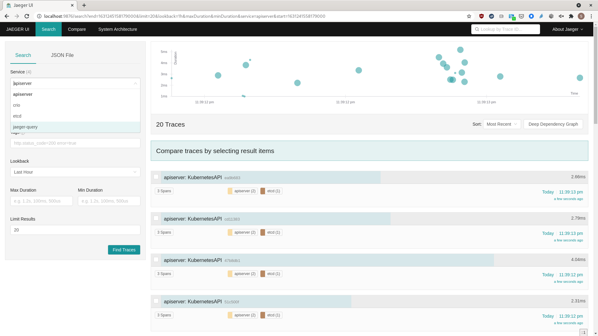
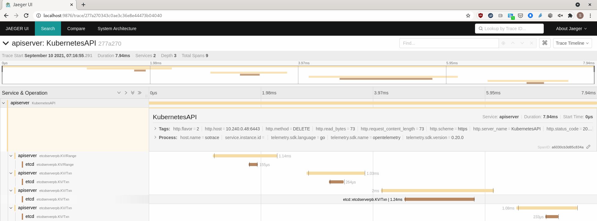
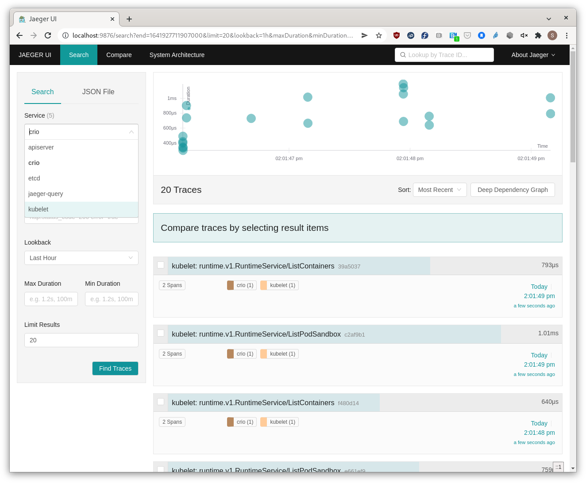

## Collect OpenTelemetry (OTLP) From K8s Core

#### Goals

* Configure machine to run a kubeadm cluster with CRI-O
* Kubeadm cluster with apiserver, CRI-O, & etcd OpenTelemetry trace exports
* (bonus) Replace kubelet with locally built binary from [Tracing PR](https://github.com/kubernetes/kubernetes/pull/105126)
* OpenTelemetry-Collector to collect trace data from apiserver, etcd, kubelet & CRI-O
* Jaeger all-in-one to visualize trace data

#### Outcome

APIServer, Etcd traces


APIServer, Etcd spans


Kubelet, CRI-O traces


#### VM Details

* Centos8-Stream VM (gcp)
* 8vCPUs,32 GB memory, 20GB disk - probably don't need all that

## Configure VM

### Install & configure CRI-O
* [Configure CNI, install & start CRI-O](https://github.com/sallyom/otel-k8s-microshift/blob/otel-kubeadm-tracing-setup/crio-centos-8.md)

### Configure for kubeadm
* [Configure system to run Kubeadm](https://github.com/sallyom/otel-kubeadm/blob/otel-kubeadm-tracing-setup/kubeadm-setup.md)


## Launch Kubeadm Cluster

#### APIServer, Etcd, and CRI-O will export OTLP Traces

Trace configuration file will be volume mounted in APIserver pod

```shell
# if the repository is not cloned yet
git clone https://github.com/sallyom/otel-kubeadm.git

mkdir /tmp/trace && cp trace.yaml /tmp/trace/trace.yaml
```

Now run kubeadm to launch K8s control plane. Notice the extra arguments
configured for etcd and APIServer in [kubeadm-config.yaml](https://github.com/sallyom/otel-kubeadm/blob/otel-kubeadm-tracing-setup/kubeadm-config.yaml).

```shell
sudo su
kubeadm init --config kubeadm-config.yaml
exit
```

Upon successful launch copy the admin config to $HOME

```shell
mkdir $HOME/.kube
sudo cp -i /etc/kubernetes/admin.conf $HOME/.kube/config
sudo chown $(id -u):$(id -g) $HOME/.kube/config
```

Make master node schedulable

```shell
kubectl taint nodes --all node-role.kubernetes.io/master-
```

## Optional: Replace kubelet with locally built binary from trace PR in-progress

Because a version drift between `kubeadm` and `kubelet` will result in kubeadm error,
have to launch the kubeadm cluster first, _then_ replace kubelet with below commands.

```shell
cd && git clone https://github.com/kubernetes/kubernetes && cd kubernetes
git fetch https://github.com/sallyom/kubernetes tracing-kubelet
git checkout FETCH_HEAD # git checkout -b sallyom-trace or stay in detached
sudo dnf install -y rsync
make kubelet
sudo su
systemctl stop kubelet
cp _output/bin/kubelet /bin/
```
Modify cluster KubeletConfiguration and restart kubelet service
Here are 2 different ways of configuring KubeletConfiguration. I do both,
but probably only need 1 or the other.

1)
```shell
cd ../otel-kubeadm # checkout of this repository
cp kubelet-trace-config.yaml /var/lib/kubelet/config.yaml
systemctl daemon-reload && systemctl restart crio && systemctl restart kubelet
exit # back to normal user mode
cd ../otel-kubeadm
```

2)
```shell
oc edit configmap kubelet-config-1.24 -n kube-system
# add the following 

    featureGates:
      KubeletTracing: true
    tracing: {endpoint: "127.0.0.1:4317", samplingRatePerMillion: 999999}

# not sure this is required, but also I
systemctl daemon-reload && systemctl restart crio && systemctl restart kubelet
```

## Deploy OpenTelemetry-Agent,Collector, DaemonSet, Configmaps, Deployment, ClusterRoleBinding

```shell
kubectl create ns otel
kubectl apply -f otel-sa-crb-cm-agent-collector-dep-ds-svc.yaml -n otel
```

* Configure `otel-agent-conf configmap` exporter data
    1. View ClusterIP from `kubectl get -n otel service otel-collector` _note the ClusterIP_
    2. `kubectl edit cm/otel-agent-conf -n otel` modify exporter otlp endpoint to match ClusterIP noted above
    3. `kubectl delete pod/otel-agent-podname` to refresh with updated configmap

## Deploy Jaeger All-in-One

*https://www.jaegertracing.io/docs/1.36/operator/#installing-the-operator-on-kubernetes*

#### Apply all components in Jaeger All-in-One according to Jaeger documentation.

**Note:** Jaeger operator is available through [Operator Hub](https://operatorhub.io/)
If running in OKD or OpenShift it's trivial to launch Jaeger Operator. The below resources are
deployed with community operator.

```shell
kubectl create namespace observability
kubectl apply -f https://github.com/jaegertracing/jaeger-operator/releases/download/v1.36.0/jaeger-operator.yaml -n observability
```

#### Edit Jaeger operator deployment to watch all namespaces

```shell
kubectl edit deployment -n observability
```

Update this section

```yaml
---
     spec:
        containers:
        - args:
          - start
          env:
          - name: WATCH_NAMESPACE
            value: ""
---
```

#### Create Jaeger Instance

When Jaeger custom resource is created, Jaeger operator triggers resource creation 
in the same namespace as the Jaeger CR.

```shell
kubectl apply -f jaeger.yaml -n otel
# wait for oteljaeger pod to be running, then forward 16686 of pod to localhost:16686 in VM
kubectl port-forward <oteljaeger-pod> -n otel 16686:16686
```

*If running kubeadm in a gcp cluster, forward port 16686 to local system localhost like so*

```shell
gcloud compute ssh <machine-name> --zone=<zone> -- -L 9876:127.0.0.1:16686
```

`Jaeger UI is @localhost:16686 or @localhost:9876 in above gcloud example`      

**Trace data from APIServer, etcd, and CRI-O should be visible!**

## Deploy Kubeadm UI (optional)

```shell
kubectl apply -f https://raw.githubusercontent.com/kubernetes/dashboard/v2.3.1/aio/deploy/recommended.yaml
kubectl proxy

kubectl apply -f sa-admin.yaml -n otel
kubectl apply -f clusterrolebinding-admin.yaml
```

*If in gcp, forward :8001 to localhost of local system, otherwise, Kube UI @localhost:8001*

```shell
gcloud compute ssh <machine-name> --zone=<zone> -- -L 9888:127.0.0.1:8001
```

## Bonus
Try this [k8s-hello-mutating-webhook example application](https://github.com/sallyom/k8s-hello-mutating-webhook)!
Use the test-deployment in that example to scale up and down pods, to generate activity with
etcd, CRI-O, and APIServer.
